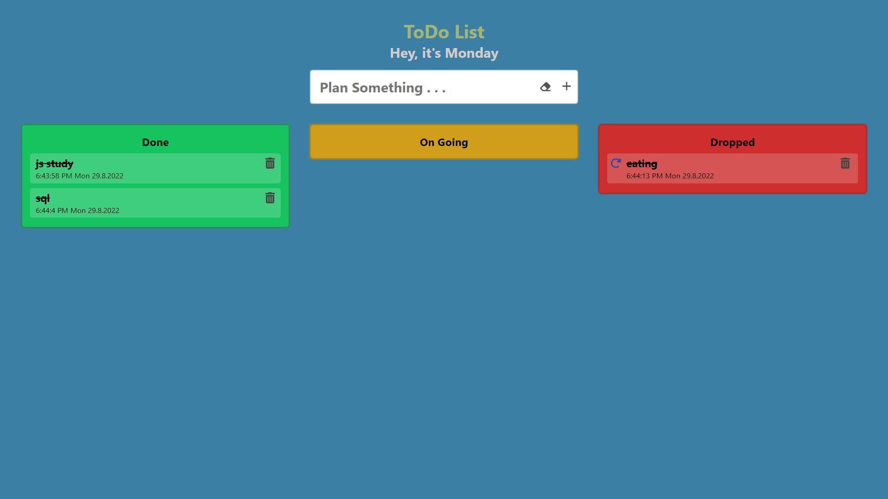

# ToDo App 

ToDo List App is a kind of app that is generally used to maintain our
day-to-day tasks or list everything that we have to do. I developed
this website with a self-created UI design. With **React.Js** front-end
and **local storage** as backend

## Available Scripts

In the project directory, you can run:

### `npm start`

Runs the app in the development mode.\
Open [http://localhost:3000](http://localhost:3000) to view it in your browser.

The page will reload when you make changes.\
You may also see any lint errors in the console.

## Demo

